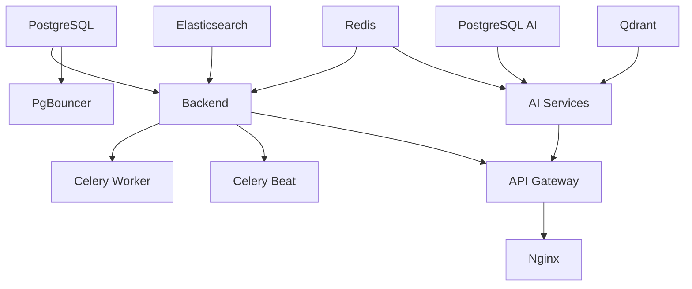

# E-Commerce Platform - Production Architecture

## Table of Contents
- [Architecture Overview](#architecture-overview)
- [Network Topology](#network-topology)
- [Routing Table](#routing-table)
- [Security Model](#security-model)
- [Service Dependencies](#service-dependencies)
- [Data Flow](#data-flow)

---

## Architecture Overview

### High-Level Architecture Diagram

```
┌─────────────────────────────────────────────────────────────────────┐
│                          INTERNET / CLIENTS                          │
└────────────────────────────────┬────────────────────────────────────┘
                                 │
                                 │ HTTPS (443)
                                 │ HTTP  (80) → Redirect to HTTPS
                                 ▼
┌─────────────────────────────────────────────────────────────────────┐
│                                                                       │
│                      NGINX REVERSE PROXY                             │
│                    (ONLY PUBLIC SERVICE)                             │
│                                                                       │
│  • SSL Termination                                                   │
│  • Rate Limiting                                                     │
│  • Security Headers                                                  │
│  • Static File Serving                                               │
│                                                                       │
└────────────────────────────────┬────────────────────────────────────┘
                                 │
                                 │ HTTP (Internal)
                                 │ Network: public_network
                                 ▼
┌─────────────────────────────────────────────────────────────────────┐
│                                                                       │
│                       API GATEWAY (FastAPI)                          │
│                    (SINGLE CONTROL PLANE)                            │
│                                                                       │
│  • Request Routing                                                   │
│  • Authentication & Authorization                                    │
│  • Circuit Breakers                                                  │
│  • Retry Logic                                                       │
│  • Distributed Tracing                                               │
│  • Metrics Collection                                                │
│                                                                       │
└─────────────┬───────────────────────────────────────┬───────────────┘
              │                                        │
              │ backend_network                        │ ai_network
              ▼                                        ▼
┌─────────────────────────────┐      ┌──────────────────────────────────┐
│   BACKEND SERVICES          │      │   AI MICROSERVICES               │
├─────────────────────────────┤      ├──────────────────────────────────┤
│                             │      │                                  │
│  • Django Backend (8000)    │      │  • Recommender      (8001)       │
│  • Celery Worker            │      │  • Search Engine    (8002)       │
│  • Celery Beat              │      │  • Pricing Engine   (8003)       │
│                             │      │  • Chatbot RAG      (8004)       │
│  Databases:                 │      │  • Fraud Detection  (8005)       │
│  • PostgreSQL  (5432)       │      │  • Forecasting      (8006)       │
│  • PgBouncer   (6432)       │      │  • Visual Recog.    (8007)       │
│  • Redis       (6379)       │      │                                  │
│  • Elasticsearch (9200)     │      │  Databases:                      │
│  • RabbitMQ    (5672)       │      │  • PostgreSQL AI    (5432)       │
│                             │      │  • Redis            (6379)       │
│                             │      │  • Qdrant           (6333)       │
│                             │      │  • RabbitMQ         (5672)       │
└─────────────────────────────┘      └──────────────────────────────────┘
              │                                        │
              └────────────┬───────────────────────────┘
                           │ monitoring_network
                           ▼
┌─────────────────────────────────────────────────────────────────────┐
│                      MONITORING SERVICES                             │
│                                                                       │
│  • Prometheus (9090)  - Metrics Collection                           │
│  • Grafana    (3000)  - Visualization                                │
│  • Jaeger     (16686) - Distributed Tracing                          │
│                                                                       │
└─────────────────────────────────────────────────────────────────────┘
```

---

## Network Topology

### Network Segmentation

The platform uses **4 isolated Docker networks** for security:

| Network | Purpose | Services | External Access |
|---------|---------|----------|-----------------|
| **public_network** | Public-facing traffic | Nginx, API Gateway | Yes (Nginx only) |
| **backend_network** | Backend services & DBs | API Gateway, Backend, DBs, Queue | No (internal only) |
| **ai_network** | AI services & vector DBs | API Gateway, AI Services, Qdrant | No (internal only) |
| **monitoring_network** | Metrics & tracing | All services, Prometheus, Grafana | No (internal only) |

### Network Flow Rules

```
✓ Nginx (public_network)         → API Gateway (public_network)
✓ API Gateway (backend_network)  → Backend Services
✓ API Gateway (ai_network)        → AI Services
✓ Prometheus (monitoring_network) → All Services (metrics scraping)
✗ Direct access to Backend/AI services from Internet
✗ Direct service-to-service calls (must go through Gateway)
```

### Production Security

In **production** (`docker-compose.prod.yaml`):
- `backend_network`: **internal: true** (no external routing)
- `ai_network`: **internal: true** (no external routing)
- **Only Nginx** exposes ports 80 and 443
- All other services have `ports: []`

---

## Routing Table

### External → Nginx Routing

| Client Request | Nginx Upstream |
|----------------|----------------|
| `https://api.yourdomain.com/*` | → `api_gateway:8080` |
| `https://api.yourdomain.com/static/*` | → Served directly by Nginx |
| `https://api.yourdomain.com/media/*` | → Served directly by Nginx |

### Nginx → API Gateway Routing

| Nginx Path | API Gateway Path | Purpose |
|------------|------------------|---------|
| `/api/backend/*` | → `/backend/*` | Django REST API |
| `/api/ai/*` | → `/ai/*` | AI Services |
| `/api/auth/*` | → `/backend/auth/*` | Authentication (stricter rate limiting) |

### API Gateway → Internal Services Routing

#### Backend Routes

| Gateway Path | Internal Service | Description |
|--------------|------------------|-------------|
| `/backend/*` | `http://backend:8000/*` | Django REST Framework API |

**Examples:**
- `/backend/api/products/` → `backend:8000/api/products/`
- `/backend/api/orders/` → `backend:8000/api/orders/`
- `/backend/admin/` → `backend:8000/admin/`

#### AI Service Routes

| Gateway Path | Internal Service | Description |
|--------------|------------------|-------------|
| `/ai/recommender/*` | `http://recommender:8001/*` | Product recommendations |
| `/ai/search/*` | `http://search:8002/*` | Semantic search |
| `/ai/pricing/*` | `http://pricing:8003/*` | Dynamic pricing |
| `/ai/chatbot/*` | `http://chatbot:8004/*` | Customer support chatbot |
| `/ai/fraud/*` | `http://fraud:8005/*` | Fraud detection |
| `/ai/forecasting/*` | `http://forecasting:8006/*` | Demand forecasting |
| `/ai/vision/*` | `http://vision:8007/*` | Visual recognition |

**Examples:**
- `/ai/recommender/user/123/` → `recommender:8001/user/123/`
- `/ai/search/query/` → `search:8002/query/`
- `/ai/pricing/calculate/` → `pricing:8003/calculate/`

### Complete Request Flow Example

```
Client Request:
  https://api.yourdomain.com/api/ai/recommender/user/123/

Flow:
  1. Client → Nginx (port 443)
  2. Nginx → API Gateway (rewrite: /ai/recommender/user/123/)
  3. API Gateway → Recommender Service (http://recommender:8001/user/123/)
  4. Recommender ← PostgreSQL AI, Redis (internal queries)
  5. Response flows back: Recommender → Gateway → Nginx → Client
```

---

## Security Model

### 1. **Network Isolation**

- **Zero Trust Architecture**: No service trusts any other by default
- **Internal Networks**: Backend and AI networks are isolated from internet
- **Single Entry Point**: Only Nginx can receive external traffic
- **No Direct Access**: Backend/AI services cannot be accessed directly

### 2. **Port Exposure**

**Development** (`docker-compose.yaml`):
```yaml
# Services expose ports for debugging
backend:
  ports: ["8000:8000"]  # Accessible on localhost:8000
```

**Production** (`docker-compose.prod.yaml`):
```yaml
# All ports removed except Nginx
backend:
  ports: []  # NOT accessible from outside

nginx:
  ports:
    - "80:80"    # Only Nginx
    - "443:443"  # exposes ports
```

### 3. **API Gateway Security**

The API Gateway provides multiple security layers:

#### Authentication
- JWT token validation
- Token expiration checking
- Scopes/permissions verification

#### Rate Limiting
- Per-IP rate limiting
- Per-user rate limiting
- Different limits for different endpoints

#### Circuit Breakers
- Prevents cascading failures
- Automatic service health detection
- Graceful degradation

#### Request Validation
- Input sanitization
- Schema validation
- Size limits

### 4. **Nginx Security**

#### SSL/TLS Configuration
```nginx
ssl_protocols TLSv1.2 TLSv1.3;
ssl_ciphers HIGH:!aNULL:!MD5;
ssl_prefer_server_ciphers on;
```

#### Security Headers
```nginx
add_header Strict-Transport-Security "max-age=31536000; includeSubDomains" always;
add_header X-Frame-Options "SAMEORIGIN" always;
add_header X-Content-Type-Options "nosniff" always;
add_header X-XSS-Protection "1; mode=block" always;
```

#### Rate Limiting
```nginx
limit_req_zone $binary_remote_addr zone=api_limit:10m rate=10r/s;
limit_req_zone $binary_remote_addr zone=auth_limit:10m rate=5r/s;
limit_conn_zone $binary_remote_addr zone=conn_limit:10m;
```

---

## Service Dependencies

### Startup Order



### Health Check Chain

All services implement health checks:

```yaml
healthcheck:
  test: ["CMD", "curl", "-f", "http://localhost:8000/health"]
  interval: 30s
  timeout: 10s
  retries: 3
```

Health check endpoints:
- Backend: `http://backend:8000/api/health/`
- Gateway: `http://api_gateway:8080/health`
- AI Services: `http://<service>:<port>/health`
- Databases: Native health checks (pg_isready, redis-cli ping, etc.)

---

## Data Flow

### 1. **User Request Flow**

```
User → Nginx → API Gateway → Backend → PostgreSQL
                   ↓
                 Redis (cache)
                   ↓
              Elasticsearch (search)
```

### 2. **AI Request Flow**

```
User → Nginx → API Gateway → AI Service → PostgreSQL AI
                                  ↓
                               Qdrant (vectors)
                                  ↓
                               Redis (cache)
```

### 3. **Background Task Flow**

```
Backend → Celery Worker → RabbitMQ → Processing
             ↓
        PostgreSQL
             ↓
        External APIs (Stripe, AWS, etc.)
```

### 4. **Monitoring Flow**

```
All Services → Prometheus (metrics)
                   ↓
               Grafana (visualization)

All Services → Jaeger (traces)
                   ↓
              Distributed Tracing UI
```

---

## Port Reference

### Production Ports (Internal Only)

| Service | Internal Port | External Port | Production Access |
|---------|---------------|---------------|-------------------|
| **Nginx** | 80, 443 | 80, 443 | ✓ Public |
| **API Gateway** | 8080 | - | ✗ Internal only |
| **Backend** | 8000 | - | ✗ Internal only |
| **PostgreSQL** | 5432 | - | ✗ Internal only |
| **PostgreSQL AI** | 5432 | - | ✗ Internal only |
| **Redis** | 6379 | - | ✗ Internal only |
| **Elasticsearch** | 9200, 9300 | - | ✗ Internal only |
| **Qdrant** | 6333, 6334 | - | ✗ Internal only |
| **RabbitMQ** | 5672, 15672 | - | ✗ Internal only |
| **Recommender** | 8001 | - | ✗ Internal only |
| **Search** | 8002 | - | ✗ Internal only |
| **Pricing** | 8003 | - | ✗ Internal only |
| **Chatbot** | 8004 | - | ✗ Internal only |
| **Fraud** | 8005 | - | ✗ Internal only |
| **Forecasting** | 8006 | - | ✗ Internal only |
| **Vision** | 8007 | - | ✗ Internal only |
| **Prometheus** | 9090 | - | ✗ Internal only |
| **Grafana** | 3000 | - | ✗ Internal only |
| **Jaeger** | 16686 | - | ✗ Internal only |

### Development Ports (All Exposed)

In development mode, all services expose their ports to `localhost` for debugging.

```bash
# Start in development mode
docker-compose -f docker-compose.yaml up -d

# Access services locally:
# Backend:     http://localhost:8000
# Gateway:     http://localhost:8080
# Grafana:     http://localhost:3001
# Prometheus:  http://localhost:9090
# etc.
```

---

## Production vs Development

| Aspect | Development | Production |
|--------|-------------|------------|
| **Exposed Ports** | All services | Only Nginx (80, 443) |
| **Networks** | Not isolated | Internal networks isolated |
| **SSL** | Optional | Required (HTTPS only) |
| **Logging** | DEBUG level | WARNING level |
| **Resource Limits** | None | CPU and memory limits |
| **Restart Policy** | unless-stopped | always |
| **Workers** | Few (4) | Many (8+) |
| **Debug Mode** | Enabled | Disabled |

---

## Next Steps

- [Deployment Guide](./DEPLOYMENT.md)
- [Security Checklist](./SECURITY_CHECKLIST.md)
- [Monitoring Guide](../monitoring/README.md)
