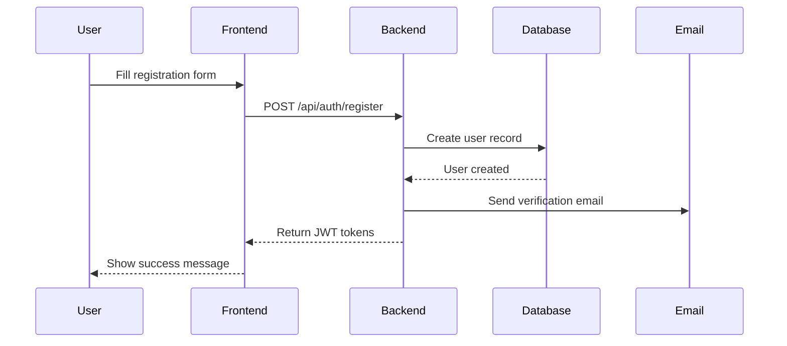
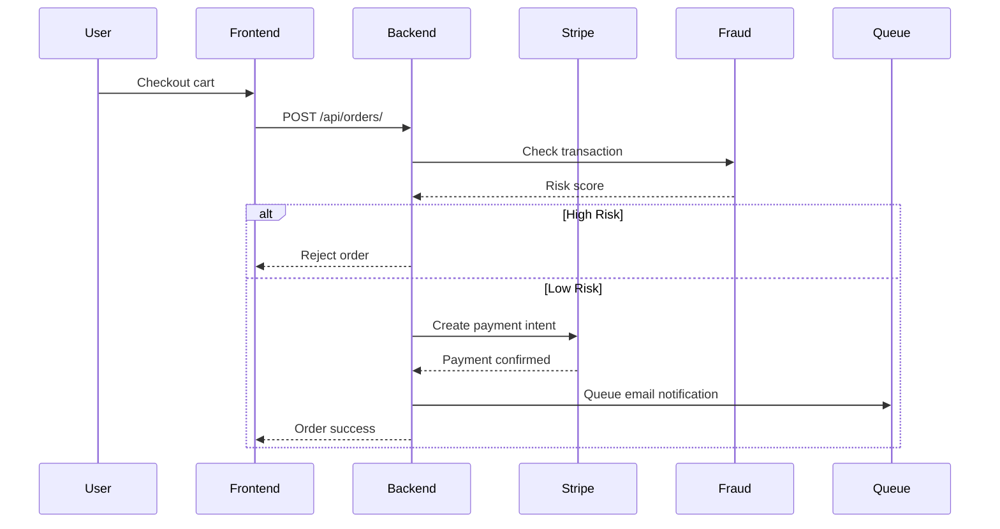
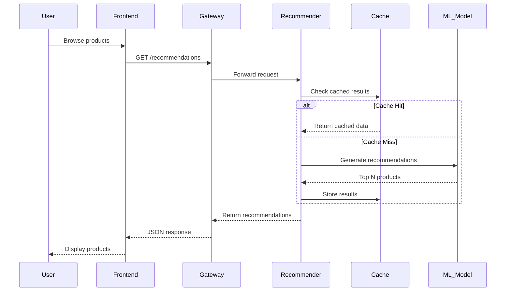
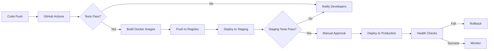

# E-Commerce Platform Architecture

## Table of Contents
1. [System Overview](#system-overview)
2. [Architecture Diagram](#architecture-diagram)
3. [Component Architecture](#component-architecture)
4. [Service Communication](#service-communication)
5. [Data Flow](#data-flow)
6. [Technology Stack](#technology-stack)
7. [Security Architecture](#security-architecture)
8. [Scalability Strategy](#scalability-strategy)
9. [Deployment Architecture](#deployment-architecture)

---

## System Overview

This is a **production-grade microservices-based e-commerce platform** with integrated AI/ML capabilities. The platform consists of three main components:

- **Backend API** - Django REST Framework monolith serving core e-commerce functionality
- **AI Services** - 7 specialized FastAPI microservices providing ML/AI features

### Key Features
- User authentication & authorization (JWT)
- Product catalog management
- Shopping cart & order processing
- Payment processing (Stripe integration)
- Real-time notifications
- Business analytics
- AI-powered recommendations
- Semantic search with vector embeddings
- Dynamic pricing optimization
- Fraud detection
- Demand forecasting
- RAG-based chatbot
- Visual product recognition

---

## Architecture Diagram

### High-Level System Architecture

```
┌─────────────────────────────────────────────────────────────────────────┐
│                           CLIENT APPLICATIONS                           │
│  ┌──────────────────┐  ┌──────────────────┐  ┌──────────────────┐     │
│  │   Web Browser    │  │   Mobile App     │  │   Admin Panel    │     │
│  │   (Next.js)      │  │   (React Native) │  │   (Django Admin) │     │
│  └─────────┬────────┘  └─────────┬────────┘  └─────────┬────────┘     │
└────────────┼─────────────────────┼─────────────────────┼───────────────┘
             │                     │                     │
             └─────────────────────┼─────────────────────┘
                                   │
                                   ▼
┌─────────────────────────────────────────────────────────────────────────┐
│                            LOAD BALANCER / CDN                           │
│                           (Nginx / Cloudflare)                           │
└────────────────────────────────┬────────────────────────────────────────┘
                                 │
                ┌────────────────┴────────────────┐
                │                                 │
                ▼                                 ▼
┌───────────────────────────────┐   ┌───────────────────────────────┐
│      API GATEWAY (8080)       │   │   BACKEND API (8000)          │
│      FastAPI Gateway          │   │   Django REST Framework       │
│                               │   │                               │
│  - Authentication             │   │  - User Management            │
│  - Rate Limiting              │   │  - Product Catalog            │
│  - Request Routing            │   │  - Order Processing           │
│  - Circuit Breaker            │   │  - Payment Integration        │
│  - Load Balancing             │   │  - Notifications              │
│  - Logging & Monitoring       │   │  - Analytics                  │
└───────────┬───────────────────┘   └───────────┬───────────────────┘
            │                                   │
            │                                   │
            │  ┌────────────────────────────────┘
            │  │
            ▼  ▼
┌─────────────────────────────────────────────────────────────────────────┐
│                            AI MICROSERVICES                              │
│                                                                          │
│  ┌──────────────┐  ┌──────────────┐  ┌──────────────┐                 │
│  │ Recommender  │  │    Search    │  │   Pricing    │                 │
│  │   (8001)     │  │    (8002)    │  │   (8003)     │                 │
│  └──────────────┘  └──────────────┘  └──────────────┘                 │
│                                                                          │
│  ┌──────────────┐  ┌──────────────┐  ┌──────────────┐                 │
│  │   Chatbot    │  │    Fraud     │  │  Forecasting │                 │
│  │   (8004)     │  │    (8005)    │  │   (8006)     │                 │
│  └──────────────┘  └──────────────┘  └──────────────┘                 │
│                                                                          │
│  ┌──────────────┐                                                       │
│  │    Vision    │                                                       │
│  │    (8007)    │                                                       │
│  └──────────────┘                                                       │
└─────────────────────────────────────────────────────────────────────────┘
            │
            ▼
┌─────────────────────────────────────────────────────────────────────────┐
│                          DATA & CACHE LAYER                              │
│                                                                          │
│  ┌──────────────┐  ┌──────────────┐  ┌──────────────┐                 │
│  │  PostgreSQL  │  │    Redis     │  │    Qdrant    │                 │
│  │   (5432)     │  │    (6379)    │  │ Vector DB    │                 │
│  │  Main DB     │  │    Cache     │  │   (6333)     │                 │
│  └──────────────┘  └──────────────┘  └──────────────┘                 │
│                                                                          │
│  ┌──────────────┐  ┌──────────────┐  ┌──────────────┐                 │
│  │ PostgreSQL   │  │ Elasticsearch│  │   RabbitMQ   │                 │
│  │   AI (5433)  │  │    (9200)    │  │   (5672)     │                 │
│  │  ML Data     │  │    Search    │  │  Msg Queue   │                 │
│  └──────────────┘  └──────────────┘  └──────────────┘                 │
└─────────────────────────────────────────────────────────────────────────┘
            │
            ▼
┌─────────────────────────────────────────────────────────────────────────┐
│                     BACKGROUND PROCESSING LAYER                          │
│                                                                          │
│  ┌──────────────┐  ┌──────────────┐  ┌──────────────┐                 │
│  │   Celery     │  │  Celery Beat │  │   ML Model   │                 │
│  │   Workers    │  │  (Scheduler) │  │   Training   │                 │
│  └──────────────┘  └──────────────┘  └──────────────┘                 │
└─────────────────────────────────────────────────────────────────────────┘
            │
            ▼
┌─────────────────────────────────────────────────────────────────────────┐
│                    MONITORING & OBSERVABILITY                            │
│                                                                          │
│  ┌──────────────┐  ┌──────────────┐  ┌──────────────┐                 │
│  │  Prometheus  │  │    Grafana   │  │    Sentry    │                 │
│  │   (9090)     │  │    (3000)    │  │ Error Track  │                 │
│  └──────────────┘  └──────────────┘  └──────────────┘                 │
└─────────────────────────────────────────────────────────────────────────┘
            │
            ▼
┌─────────────────────────────────────────────────────────────────────────┐
│                       EXTERNAL SERVICES                                  │
│                                                                          │
│  ┌──────────────┐  ┌──────────────┐  ┌──────────────┐                 │
│  │    Stripe    │  │    AWS S3    │  │   SendGrid   │                 │
│  │   Payments   │  │    Storage   │  │    Email     │                 │
│  └──────────────┘  └──────────────┘  └──────────────┘                 │
└─────────────────────────────────────────────────────────────────────────┘
```

---

## Component Architecture

### 1. Backend API (Django REST Framework)

#### Architecture Pattern
- **Monolithic architecture** with modular Django apps
- **3-tier architecture**: Presentation (API) → Business Logic → Data Layer

#### Directory Structure
```
backend/
├── apps/
│   ├── accounts/      # User authentication, profiles
│   ├── products/      # Product catalog, inventory
│   ├── orders/        # Shopping cart, order management
│   ├── payments/      # Stripe integration, transactions
│   ├── notifications/ # Email, push notifications
│   └── analytics/     # Business intelligence, reporting
├── config/            # Django settings (base, dev, prod)
├── core/              # Shared utilities, middleware
└── tests/             # Test suite
```

#### Key Components

**Authentication & Authorization**
- JWT-based authentication (access + refresh tokens)
- Role-based access control (Customer, Vendor, Admin)
- Permission classes for API endpoints
- OAuth2 integration ready

**Product Management**
- Product CRUD operations
- Category & subcategory hierarchy
- Inventory tracking
- Image upload to S3
- Elasticsearch full-text search

**Order Processing**
- Shopping cart with session management
- Order state machine (Pending → Processing → Shipped → Delivered)
- Order history & tracking
- Email notifications

**Payment Integration**
- Stripe payment processing
- Webhook handling for async events
- Refund management
- Payment history

**Background Tasks**
- Celery workers for async processing
- Email sending (order confirmation, password reset)
- Report generation
- Data export jobs

#### Database Schema
```
┌────────────┐         ┌────────────┐         ┌────────────┐
│   Users    │────────▶│   Orders   │◀────────│  Products  │
│            │         │            │         │            │
│ - id       │         │ - id       │         │ - id       │
│ - email    │         │ - user_id  │         │ - name     │
│ - password │         │ - total    │         │ - price    │
│ - role     │         │ - status   │         │ - stock    │
└────────────┘         └──────┬─────┘         └────────────┘
                              │
                              ▼
                       ┌────────────┐
                       │ OrderItems │
                       │            │
                       │ - id       │
                       │ - order_id │
                       │ - product  │
                       │ - quantity │
                       └────────────┘
```

### 2. AI Services (FastAPI Microservices)

#### Architecture Pattern
- **Microservices architecture** with domain-driven design
- Each service is independently deployable
- Shared utilities in common package

#### Service Catalog

**1. Recommendation Engine (Port 8001)**
```python
Models:
- Collaborative Filtering (User-User, Item-Item)
- Content-Based Filtering (TF-IDF, embeddings)
- Hybrid Model (weighted combination)

Endpoints:
POST /recommendations/user/{user_id}
POST /recommendations/product/{product_id}
POST /recommendations/similar
```

**2. Search Engine (Port 8002)**
```python
Features:
- Text search (BM25, TF-IDF)
- Semantic search (sentence embeddings)
- Visual search (image similarity)
- Faceted filtering

Endpoints:
POST /search/text
POST /search/semantic
POST /search/visual
POST /search/autocomplete
```

**3. Pricing Engine (Port 8003)**
```python
Capabilities:
- Dynamic pricing based on demand
- Competitor price monitoring
- Price elasticity calculation
- A/B testing support

Endpoints:
POST /pricing/optimize
POST /pricing/elasticity
GET /pricing/competitor/{product_id}
```

**4. Chatbot RAG (Port 8004)**
```python
Architecture:
- Retrieval-Augmented Generation
- Context window management
- Conversation history
- Intent classification

Endpoints:
POST /chatbot/message
GET /chatbot/history/{session_id}
POST /chatbot/feedback
```

**5. Fraud Detection (Port 8005)**
```python
Models:
- Transaction risk scoring
- User behavior analysis
- Anomaly detection (Isolation Forest)
- Device fingerprinting

Endpoints:
POST /fraud/score_transaction
POST /fraud/score_user
POST /fraud/report_fraud
```

**6. Demand Forecasting (Port 8006)**
```python
Models:
- Prophet time series
- LSTM neural networks
- Seasonal decomposition
- Inventory optimization

Endpoints:
POST /forecasting/demand/{product_id}
POST /forecasting/inventory
POST /forecasting/seasonal
```

**7. Visual Recognition (Port 8007)**
```python
Capabilities:
- Product classification
- Attribute extraction (color, style)
- Similar image search
- Quality assessment

Endpoints:
POST /vision/classify
POST /vision/extract_attributes
POST /vision/similar_images
```

### 3. API Gateway

#### Responsibilities
- **Routing** - Direct requests to appropriate services
- **Authentication** - Verify JWT tokens from backend
- **Rate Limiting** - Prevent API abuse
- **Circuit Breaker** - Handle service failures gracefully
- **Load Balancing** - Distribute load across service instances
- **Monitoring** - Collect metrics and logs

#### Routing Rules
```python
/api/v1/recommendations/*  → Recommendation Service (8001)
/api/v1/search/*           → Search Service (8002)
/api/v1/pricing/*          → Pricing Service (8003)
/api/v1/chatbot/*          → Chatbot Service (8004)
/api/v1/fraud/*            → Fraud Detection (8005)
/api/v1/forecasting/*      → Forecasting Service (8006)
/api/v1/vision/*           → Vision Service (8007)
```

### 4. Frontend (Next.js)

#### Architecture
- **App Router** with React Server Components
- **Client-side rendering** for dynamic content
- **Server-side rendering** for SEO-critical pages

#### State Management
```
┌──────────────────────────────────────┐
│         Client State                 │
├──────────────────────────────────────┤
│  Zustand (auth, cart, preferences)   │
│  React Query (server state cache)    │
└──────────────────────────────────────┘
```

---

## Service Communication

### Synchronous Communication
- **REST APIs** - Primary communication method
- **HTTP/HTTPS** - Transport protocol
- **JSON** - Data format

### Communication Patterns

```
Frontend ─────HTTP──────▶ Backend API
                          │
Frontend ─────HTTP──────▶ API Gateway ────▶ AI Services
                          │
Backend API ─────HTTP────▶ AI Services (direct call)
```

### Data Flow Example: Product Recommendation

```
1. User visits homepage
   │
   ▼
2. Frontend requests user profile
   │
   ▼
3. Backend API returns user data + token
   │
   ▼
4. Frontend requests recommendations
   │
   ▼
5. API Gateway validates token
   │
   ▼
6. Gateway forwards to Recommendation Service
   │
   ▼
7. Recommendation Service:
   - Queries user history from PostgreSQL
   - Retrieves product embeddings from cache
   - Runs ML model
   - Returns top N products
   │
   ▼
8. Frontend displays recommendations
```

### Asynchronous Communication

**Message Queue (RabbitMQ)**
```
Producer              Queue              Consumer
Backend ─────────▶ [Orders] ─────────▶ Email Service
AI Services ──────▶ [ML Jobs] ────────▶ Model Training
```

**Use Cases**
- Order confirmation emails
- ML model retraining
- Bulk data processing
- Report generation

---

## Data Flow

### User Registration Flow



### Order Processing Flow



### AI Recommendation Flow



---

## Technology Stack

### Backend Technologies

| Layer | Technology | Version | Purpose |
|-------|-----------|---------|---------|
| Framework | Django | 5.1.13 | Web framework |
| API | Django REST Framework | 3.15.2 | REST API |
| Database | PostgreSQL | 14+ | Primary database |
| Cache | Redis | 7.0 | Caching & sessions |
| Search | Elasticsearch | 8.11 | Full-text search |
| Queue | Celery + Redis | 5.5.3 | Async tasks |
| Web Server | Gunicorn | 23.0.0 | WSGI server |
| Proxy | Nginx | 1.24 | Reverse proxy |
| Auth | JWT | - | Authentication |
| Payment | Stripe | 7.10.0 | Payment processing |
| Storage | AWS S3 | - | File storage |
| Monitoring | Sentry | 2.14.0 | Error tracking |

### AI Services Technologies

| Layer | Technology | Version | Purpose |
|-------|-----------|---------|---------|
| Framework | FastAPI | 0.104.1 | API framework |
| ML Framework | PyTorch | 2.6.0 | Deep learning |
| ML Framework | Scikit-learn | 1.3.2 | Traditional ML |
| NLP | Transformers | 4.36.0 | Language models |
| NLP | SpaCy | 3.7.2 | NLP processing |
| Vision | OpenCV | 4.8.1 | Computer vision |
| Vector DB | Qdrant | 1.7.0 | Embeddings storage |
| Time Series | Prophet | 1.1.5 | Forecasting |
| Boosting | XGBoost | 2.0.3 | Gradient boosting |
| Boosting | LightGBM | 4.1.0 | Fast boosting |
| Queue | RabbitMQ | - | Message broker |
| Monitoring | Prometheus | - | Metrics |
| Monitoring | Grafana | - | Dashboards |

### Frontend Technologies

| Layer | Technology | Version | Purpose |
|-------|-----------|---------|---------|
| Framework | Next.js | 14.2.18 | React framework |
| Library | React | 18.3.1 | UI library |
| Language | TypeScript | 5.6.3 | Type safety |
| Styling | Tailwind CSS | 3.4.15 | CSS framework |
| State | Zustand | 5.0.1 | State management |
| Data Fetching | React Query | 5.59.0 | Server state |
| HTTP Client | Axios | 1.7.7 | API calls |
| Forms | React Hook Form | 7.53.2 | Form handling |
| Validation | Zod | 3.23.8 | Schema validation |

### DevOps & Infrastructure

| Component | Technology | Purpose |
|-----------|-----------|---------|
| Containerization | Docker | Service isolation |
| Orchestration | Docker Compose | Local development |
| Orchestration | Kubernetes | Production deployment |
| CI/CD | GitHub Actions | Automation |
| Monitoring | Prometheus + Grafana | Observability |
| Logging | ELK Stack | Log aggregation |
| Secret Management | HashiCorp Vault | Secret storage |
| Load Balancer | Nginx / AWS ALB | Traffic distribution |

---

## Security Architecture

### Authentication & Authorization

```
┌─────────────────────────────────────────────────────────────┐
│                      Security Layers                        │
├─────────────────────────────────────────────────────────────┤
│  Layer 1: Network Security                                  │
│  - HTTPS/TLS 1.3                                           │
│  - CORS policies                                            │
│  - Rate limiting                                            │
│                                                             │
│  Layer 2: Authentication                                    │
│  - JWT tokens (access: 15min, refresh: 7 days)            │
│  - Secure password hashing (Argon2)                        │
│  - Multi-factor authentication (optional)                  │
│                                                             │
│  Layer 3: Authorization                                     │
│  - Role-based access control (RBAC)                        │
│  - Permission-based API endpoints                          │
│  - Row-level security in database                          │
│                                                             │
│  Layer 4: Data Security                                     │
│  - Encrypted database connections                          │
│  - Encrypted data at rest                                  │
│  - PII data masking in logs                                │
│                                                             │
│  Layer 5: Application Security                              │
│  - Input validation & sanitization                         │
│  - SQL injection prevention (ORM)                          │
│  - XSS protection                                           │
│  - CSRF tokens                                              │
└─────────────────────────────────────────────────────────────┘
```

### Security Best Practices

1. **Secrets Management**
   - No hardcoded credentials
   - Environment variables for sensitive data
   - Vault integration for production

2. **API Security**
   - JWT token expiration
   - Token refresh mechanism
   - API key rotation

3. **Database Security**
   - Prepared statements (ORM)
   - Least privilege access
   - Database encryption

4. **Network Security**
   - Private VPC for services
   - Security groups / firewalls
   - DDoS protection

---

## Scalability Strategy

### Horizontal Scaling

```
┌────────────────────────────────────────────────────────────┐
│                    Load Balancer                           │
└──────────────┬─────────────────────────────────────────────┘
               │
       ┌───────┼───────┬───────┬───────┐
       │       │       │       │       │
       ▼       ▼       ▼       ▼       ▼
    ┌────┐ ┌────┐ ┌────┐ ┌────┐ ┌────┐
    │ N1 │ │ N2 │ │ N3 │ │ N4 │ │ N5 │  Backend Instances
    └────┘ └────┘ └────┘ └────┘ └────┘
       │       │       │       │       │
       └───────┴───────┴───────┴───────┘
                      │
                      ▼
               ┌──────────────┐
               │   Database   │
               │   (Primary)  │
               └──────┬───────┘
                      │
          ┌───────────┼───────────┐
          ▼           ▼           ▼
       ┌─────┐    ┌─────┐    ┌─────┐
       │ R1  │    │ R2  │    │ R3  │  Read Replicas
       └─────┘    └─────┘    └─────┘
```

### Scaling Strategies by Component

**Backend API**
- Stateless design enables horizontal scaling
- Session data stored in Redis
- File uploads to S3 (no local storage)
- Auto-scaling based on CPU/memory

**AI Services**
- Each microservice scales independently
- Model caching in Redis
- GPU instances for ML inference
- Queue-based request handling for batch processing

**Database**
- Read replicas for read-heavy workloads
- Connection pooling (PgBouncer)
- Query optimization & indexing
- Partitioning for large tables

**Cache Layer**
- Redis cluster for high availability
- Cache warming on deployment
- TTL-based expiration
- Cache invalidation strategies

### Performance Targets

| Metric | Target | Current |
|--------|--------|---------|
| API Response Time (p95) | < 200ms | TBD |
| AI Service Response (p95) | < 500ms | TBD |
| Database Query Time | < 50ms | TBD |
| Cache Hit Rate | > 80% | TBD |
| Throughput | 10K req/min | TBD |
| Concurrent Users | 50K | TBD |

---

## Deployment Architecture

### Development Environment

```
Developer Laptop
├── Docker Compose
│   ├── Backend (Django)
│   ├── Frontend (Next.js dev server)
│   ├── 7 AI Services
│   ├── PostgreSQL × 2
│   ├── Redis
│   ├── Elasticsearch
│   ├── Qdrant
│   └── RabbitMQ
└── Local code with hot reload
```

### Staging Environment

```
Cloud Platform (AWS/GCP)
├── Kubernetes Cluster
│   ├── Backend Deployment (2 replicas)
│   ├── Frontend Deployment (2 replicas)
│   ├── AI Services Deployments (1 replica each)
│   └── API Gateway (1 replica)
├── Managed Databases
│   ├── RDS PostgreSQL (Primary)
│   └── ElastiCache Redis
└── Monitoring Stack
    ├── Prometheus
    └── Grafana
```

### Production Environment

```
Cloud Platform (AWS/GCP/Azure)
├── Kubernetes Cluster (Multi-AZ)
│   ├── Backend Deployment (5+ replicas)
│   ├── Frontend Deployment (3+ replicas)
│   ├── AI Services Deployments (2-5 replicas each)
│   ├── API Gateway (3+ replicas)
│   └── Celery Workers (5+ replicas)
├── Managed Databases
│   ├── RDS PostgreSQL (Primary + 2 Read Replicas)
│   ├── ElastiCache Redis Cluster
│   └── Elasticsearch Service
├── Object Storage
│   └── S3 / Cloud Storage
├── Load Balancers
│   ├── Application Load Balancer (ALB)
│   └── Network Load Balancer (NLB)
├── CDN
│   └── CloudFront / Cloudflare
└── Monitoring & Logging
    ├── Prometheus + Grafana
    ├── ELK Stack
    └── Sentry
```

### Deployment Pipeline



---

## Disaster Recovery & High Availability

### Backup Strategy
- **Database**: Automated daily backups with 30-day retention
- **Files**: S3 versioning enabled
- **Configuration**: Git-based infrastructure as code

### Recovery Objectives
- **RTO** (Recovery Time Objective): < 1 hour
- **RPO** (Recovery Point Objective): < 5 minutes

### High Availability
- Multi-AZ deployment
- Auto-scaling groups
- Health checks & auto-recovery
- Database failover automation

---

## Monitoring & Observability

### Metrics Collection
```
Application → Prometheus → Grafana Dashboards
    ↓
  Alerts → PagerDuty / Slack
```

### Key Metrics
- Request rate, error rate, duration (RED metrics)
- Saturation (resource utilization)
- Business metrics (orders, revenue, conversions)
- ML model performance (accuracy, latency)

### Logging Strategy
```
Services → Structured JSON Logs → ELK Stack → Kibana
                                    ↓
                              Long-term Storage (S3)
```

### Distributed Tracing
- OpenTelemetry instrumentation
- Trace requests across services
- Performance bottleneck identification

---

## Future Enhancements

1. **GraphQL API** - Flexible data fetching for frontend
2. **Event Sourcing** - Audit trail for all state changes
3. **CQRS Pattern** - Separate read/write models
4. **Multi-tenancy** - Support for multiple vendors
5. **Real-time Features** - WebSocket for live updates
6. **Edge Computing** - Deploy AI models to edge locations
7. **Federated Learning** - Privacy-preserving ML
8. **A/B Testing Framework** - Experiment platform

---

## Conclusion

This architecture provides a **scalable, maintainable, and production-ready** foundation for an AI-powered e-commerce platform. The microservices approach allows independent scaling and deployment of AI capabilities, while the monolithic backend provides a solid foundation for core e-commerce functionality.

Key strengths:
- Clear separation of concerns
- Independent scalability
- Comprehensive monitoring
- Security best practices
- Modern technology stack

The architecture is designed to handle growth from MVP to enterprise scale while maintaining code quality and developer productivity.
